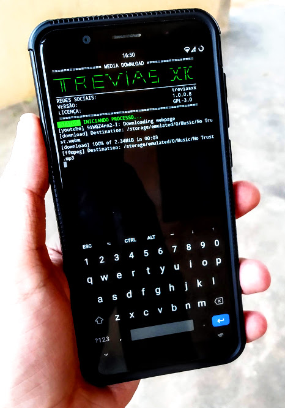

# Media Download
Esse script faz o Termux (app de celular) baixar vídeo de vários websites com o projeto open-source do youtube-dl.
## Instalação
Insira o comando bash abaixo no Termux para poder fazer a instalação.
```bash
curl -s -L https://raw.githubusercontent.com/treviasxk/media-download/main/install.sh -o install && bash install
```
 
